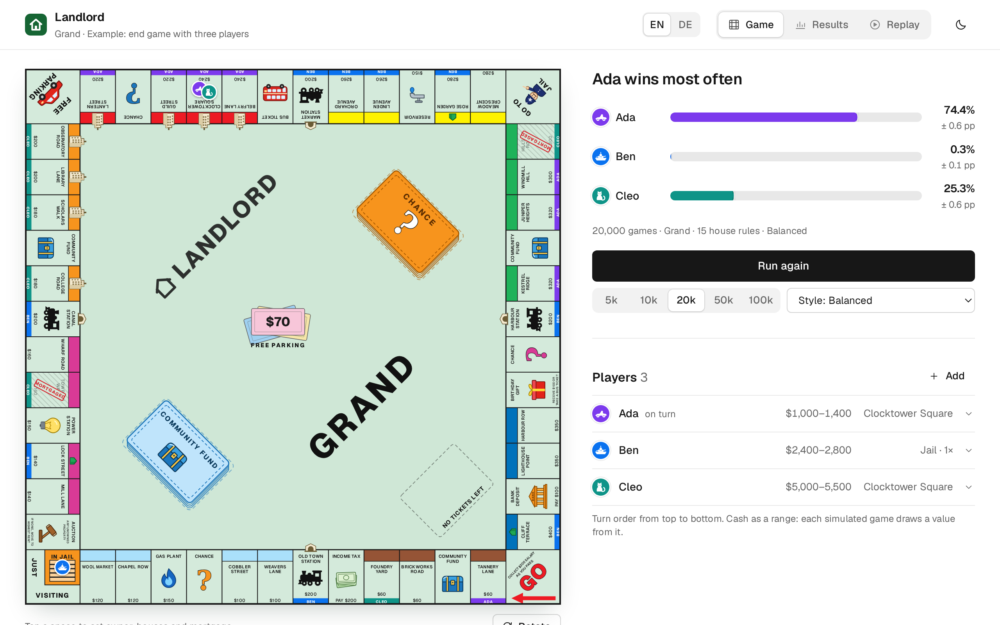
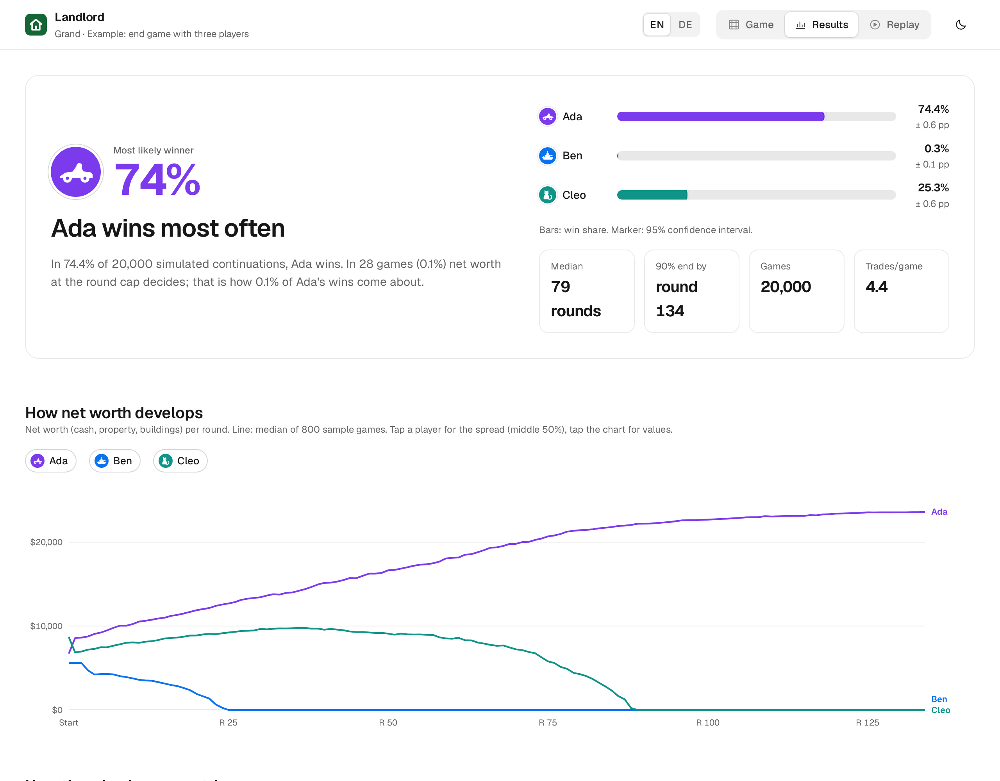
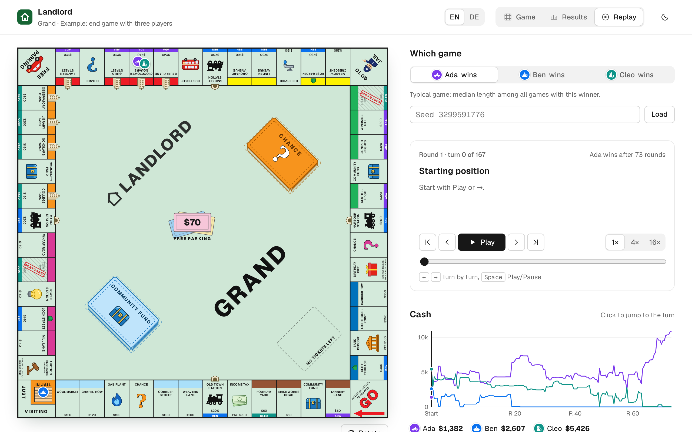
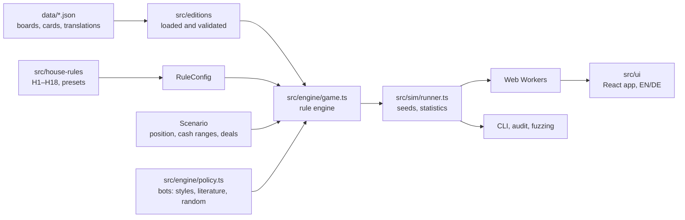

<div align="center">


# Landlord

**Who would have won? A Monte Carlo simulator for property-trading board games.**
<br>
Enter any game state, pick your table's house rules and play thousands of continuations in the browser.

[](https://github.com/nichtlegacy/landlord-sim/actions/workflows/ci.yml)
[](tsconfig.json)
[](src/ui)
[](package.json)
[](src/ui/i18n)
[](LICENSE)

[Overview](#overview) • [Features](#features) • [Quick start](#quick-start) • [Command line](#command-line) • [How it works](#how-it-works) • [Validation](#validation) • [Extending](#extending) • [Docs](docs/README.md)



</div>

## Overview

A game of the property-trading classic is abandoned at midnight. Who was going to
win? Landlord answers that with numbers: you enter the position as it is on the
table (money, ownership, houses, mortgages, who is in jail, whose turn it is, deals
between players), choose the rules you actually play by, and the engine plays the
game to the end thousands of times with bots that buy, build, bid, mortgage and trade.

Most tools in this space compute landing probabilities or rate a single trade by
rule of thumb. None we found takes an arbitrary mid-game position and returns win
chances ([related work](docs/related-work.md)). Landlord does, and it is:

- **browser-first**: the simulation runs in Web Workers, no server needed.
- **reproducible**: every game comes from a seed; the same seed gives the same games, and any game can be replayed turn by turn.
- **honest about uncertainty**: every share comes with a 95% interval, and unknown cash can be entered as a range.
- **checked against published results**: landing probabilities, a 2009 paper on games that never end, and fuzzing with random bots.

> Landlord is an independent project and not affiliated with Hasbro. The bundled
> boards use invented street names and card texts. See [Disclaimer](#disclaimer).

## Features

- **Any position as the starting point**: board editor with owners, houses, hotels, skyscrapers, depots and mortgages; cash as a range drawn per game; unknown card order shuffled per game.
- **Two boards**: *Classic* (40 spaces) and *Grand* (52 spaces with speed die, bus tickets, skyscrapers, depots and an auction space), both in English and German.
- **House rules as switches**: 18 common table rules (Free Parking pot, no rent from jail, no auctions, building limits, single-site building …), GO and bail amounts, and presets for *Official* and *Popular*.
- **Bots that trade**: they swap and sell property when both sides gain by their own valuation, split the gain in the middle and mortgage outside their sets to buy or build. Three play styles plus bots rebuilt from the literature (Friedman 2009, Bonjour et al. 2022, Darling).
- **Deals between players**: rent caps, percentage deals and jokers, applied in every simulated game.
- **What does a trade bring?** Check a concrete trade before you make it: the change in win chance for each player, measured game by game on the same dice.
- **Results that explain themselves**: net worth over time, how the shares settle, game length, a survival curve, wins by bankruptcy vs. at the round cap, who bankrupts whom, seat advantage, rule variants with paired Δ, play-style sensitivity.
- **Replay** of a typical game for each winner, turn by turn with an event log.
- **Share link**: the whole setup lives in the URL; JSON export and import; capture a real table from photos with an AI assistant prompt.
- **English and German UI** with a switch in the header.

<table>
  <tr>
    <td width="50%"></td>
    <td width="50%"></td>
  </tr>
  <tr>
    <td align="center"><sub>Results: winner, intervals, game length, net worth</sub></td>
    <td align="center"><sub>Replay: one typical game, turn by turn</sub></td>
  </tr>
</table>

## Quick start

Requires Node.js 22.18 or newer.

```bash
git clone https://github.com/nichtlegacy/landlord-sim.git
cd landlord-sim
npm ci
npm run dev
```

Open <http://localhost:5180> (the dev server listens on `0.0.0.0:5180`, so other
devices on your network can use the machine's LAN address). Click **Example end
game** under *Game state* to load a three-player position, then **Run simulation**.
20,000 games take a few seconds.

```bash
npm test             # rule tests, validation, audit, fuzzing, i18n checks
npm run build        # type check and production bundle in dist/
npm run preview      # serve the production build on port 5180
```

### Self-hosting

The app is a static bundle; any static host works. The optional Node server in
[`server/`](server) also stores finished results so returning visitors do not
recompute them:

```bash
docker build -t landlord .
docker run -p 3000:3000 -v landlord-data:/data landlord
```

`PORT` (default 3000), `STATIC_DIR` (default `dist`) and `DATA_DIR` (default `/data`)
configure it. Without the server the app simply computes locally.

## Command line

The same engine runs in the terminal, which is how the numbers in the docs are made.

| Command | What it does |
|---|---|
| `npm run sim` | Example end game under six rule sets, 20,000 games each |
| `npm run sim -- --replay 7` | One game, turn by turn |
| `npm run sim -- --sensitivity --games 2000` | All play-style combinations |
| `npm run sim -- --audit 1000` | Rule audit: invariants after every roll, build and trade |
| `npm run sim -- --fuzz 20000` | Random editions, rules, positions and bots through the audit |
| `npm run sim -- --validate friedman` | Reproduction of Friedman et al. 2009 |
| `npm run sim -- --validate seats` | First-player advantage with rotating starts |
| `npm run sim -- --validate crn` | How much paired seeds narrow a comparison |
| `npm run bench` | Games per second and a result fingerprint |

## How it works



- **One switchboard.** Every rule difference, official or house rule, is a field in `RuleConfig`. House rules are small functions that change it.
- **Bots only decide.** A policy answers questions (buy? bid how much? build? trade?); the engine checks every answer and applies it.
- **Events as data.** The engine emits structured events; the UI turns them into English or German text.
- **Paired seeds.** Game *k* of every run uses the same seed, and each player rolls from their own dice stream. Two rule variants are therefore compared on the same dice, which makes the difference far more precise than either share on its own.

Details: [architecture](docs/architecture.md), [rules](docs/rules.md),
[bots](docs/bots.md), [methodology](docs/methodology.md).

## Validation

| Check | Result | Reproduce |
|---|---|---|
| Landing probabilities vs. Truman Collins' Markov solution | all 40 squares and "in jail" within 0.12 pp | `npm test` |
| Friedman et al. 2009: share of games still running after 10,000 rounds | 12.1% (11.7–12.6%) vs. published 12% ± 1% | `npm run sim -- --validate friedman --games 20000` |
| Trading and endless games (classic board, 4 bots) | 63% reach the round cap without trading, 0% with | `npm run sim -- --validate seats` |
| First-player advantage, 4 identical bots | first seat wins 29% instead of 25% | `npm run sim -- --validate seats` |
| Rule audit | 0 violations | `npm run sim -- --audit 300` |
| Fuzzing with random bots, rules and positions | 20,000 games, 162,000 trades, 0 violations | `npm run sim -- --fuzz 20000 --seed 11` |

The fuzzer earned its place: it found a case where building on a mortgage could
push the house supply to −1. Everything, including the bugs found, is in
[docs/validation.md](docs/validation.md).

## Extending

| You want to add | Where | Guide |
|---|---|---|
| A board or a translation of one | `data/<id>/`, `src/editions/<id>/`, `src/ui/model.ts` | [editions.md](docs/editions.md) |
| A house rule | `src/house-rules/index.ts` (+ a `RuleConfig` field if needed) | [house-rules.md](docs/house-rules.md) |
| A bot or a play style | `BOTS` and `PROFILES` in `src/engine/policy.ts` | [bots.md](docs/bots.md) |
| A UI language | `src/ui/i18n/` | [CONTRIBUTING.md](CONTRIBUTING.md#translations) |

## Project structure

```text
data/              board and card data (classic, grand) with German translations
src/engine/        rule engine, bots, edition loader and validator, audit, RNG
src/editions/      edition packs: classic (40 spaces), grand (52 spaces)
src/house-rules/   house rules H1–H18, amounts, presets
src/scenarios/     the example end game
src/sim/           Monte Carlo runner, workers, fuzzing, CLI, benchmark
src/ui/            React app, i18n (en, de), charts, replay, share link, AI import
server/            optional result cache server (used by the Docker image)
docs/              architecture, rules, bots, editions, methodology, validation
```

## Documentation

Everything beyond this page is in [docs/](docs/README.md). Contributions are
welcome, see [CONTRIBUTING.md](CONTRIBUTING.md).

## License

[MIT](LICENSE).

## Disclaimer

Landlord is an independent, unofficial project. It is not affiliated with,
endorsed by or sponsored by Hasbro. Monopoly is a trademark of Hasbro; the name
appears in this project only in citations of research papers about the game. The
bundled boards, street names and card texts are original. The simulator models the
widely known rules of property-trading games so that players can analyse their own
games.
