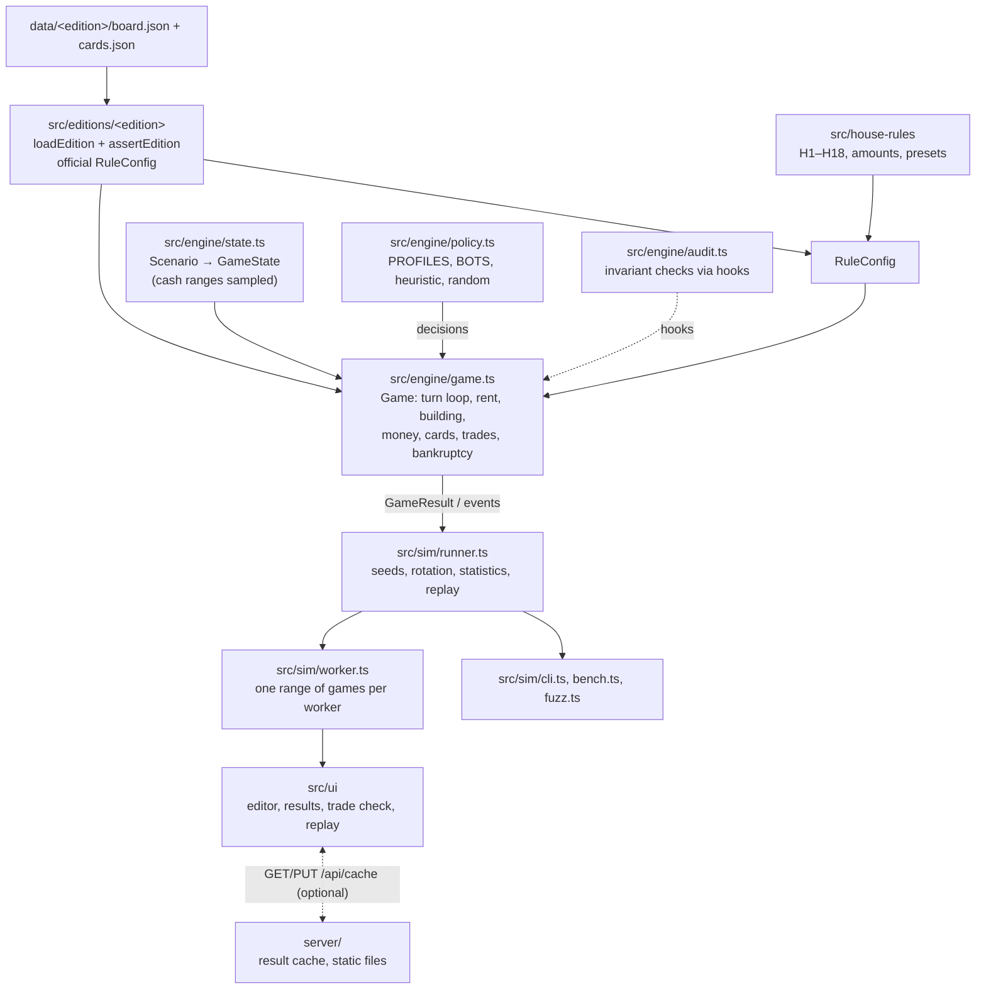

# Architecture

Landlord is one TypeScript code base that runs in three places: the browser (web
workers), the CLI (`tsx`) and the tests (Vitest). The engine has no DOM, no Node
APIs and no runtime dependencies. The only runtime dependencies are React and the
two Geist font packages, and both are used by the UI only.

## Layers

| Layer | Files | Responsibility |
|---|---|---|
| Data | `data/classic/`, `data/grand/` | Board, prices, rents, supply, card decks, translations. No rules. |
| Editions | `src/editions/classic/index.ts`, `src/editions/grand/index.ts` | Load and validate the data; export the edition and its official `RuleConfig`. |
| House rules | `src/house-rules/index.ts` | Each house rule is a function `RuleConfig → RuleConfig`. |
| Scenarios | `src/engine/state.ts`, `src/scenarios/example.ts` | A position with uncertain values; `buildState` samples one concrete `GameState` per game. |
| Engine | `src/engine/game.ts`, `types.ts`, `rng.ts` | Applies the rules. Every choice a player makes goes through a `Policy`. |
| Policies | `src/engine/policy.ts` | Bots. They only read the game; the engine validates and applies what they return. |
| Runner | `src/sim/runner.ts`, `worker.ts` | Many seeded games, aggregated into `RunStats`; replays of single games. |
| Tools | `src/sim/cli.ts`, `bench.ts`, `fuzz.ts`, `src/engine/audit.ts` | Terminal runs, validations, benchmark, fuzzing, rule audit. |
| UI | `src/ui/` | React app: board editor, results, variant and style comparison, trade check, replay, share links, AI-assisted import. |
| Cache server (optional) | `server/`, `vite.config.ts`, `Dockerfile` | Stores finished results so a reload does not recompute them. |

## The turn loop

`Game.run()` calls `playTurn()` until one player is left or the round cap is
passed. One turn (`playTurn` in `src/engine/game.ts`):

1. **Trade phase** (if `rules.trading`): the player on turn may make up to three
   offers, each to one other player (`MAX_OFFERS = 3`).
2. **Jail** (if jailed): card, bail or a roll for doubles (`jailTurn`).
3. **Roll loop** (`rollLoop`): optionally a bus ticket instead of the roll; two
   white dice plus the speed die if the rules have one; triples, third doubles,
   movement, landing, bonus move, bus face; again on doubles.
4. **Free actions** (`freeActions`): building on every group (when
   `build.timing` is `any_turn`), then lifting mortgages.
5. **Next player.** The round counter goes up when play wraps to player 0.

Landing on a space is `resolve()`. It dispatches on the space type: property,
tax, card, go to jail, free parking, auction, birthday gift, bus ticket. Debts go
through `pay()`, which liquidates and, if that is not enough, bankrupts.

## RuleConfig: the single switchboard

Every difference between editions, between official rules and house rules, and
between "how the game continues" options is a field of `RuleConfig`
(`src/engine/types.ts`). The engine never asks which edition it is playing.

| Field | Classic (official) | Grand (official) | Used by |
|---|---|---|---|
| `goSalary`, `goLandTotal` | 200, `null` | 200, `null` | GO amounts (H5-style amounts) |
| `speedDie` | `null` | faces `1,2,3,bonus,bonus,bus`, `bonusMove: 'official'`, bus `ticket_or_ride` / `ride` | H1, H7, H8, H13 |
| `triplesAnySpace` | `false` | `true` | triples |
| `build.requirement` | `full_group` | `all_but_one` | building threshold |
| `build.skyscraperNeedsFullGroup` | `true` | `true` | skyscrapers |
| `build.timing`, `maxUnitsPerAction` | `any_turn`, `null` | `any_turn`, `null` | H4, H3 |
| `build.singleSiteOnLanding`, `singleSiteMaxLevel` | `false`, 4 | `false`, 4 | H10, H16 |
| `jail` | fine 50, 3 attempts, `pay_and_move`, `move`, rent while jailed, pay then roll | same | H6, H11, bail amount |
| `freeParkingPot` | `false` | `false` | H9 |
| `unlimitedSupply` | `false` | `false` | H12 |
| `bankReturn` | `null` | `null` | H14 (0.75) |
| `bankruptcyToBank` | `false` | `false` | H15 |
| `auctionOnDecline`, `auctionSpaceOptional` | `true`, `false` | `true`, `false` | H17, H18 |
| `busSquareWhenEmpty` | `nothing` | `nothing` | H8 |
| `buying`, `building`, `trading` | `true` | `true` | continuation switches |
| `doublesAgain` | `true` | `true` | Friedman reproduction |
| `unimprovedMultiplier` | all-but-one 1, all 2 | all-but-one 2, all 3 | site rent |
| `mortgageInterest` | 0.1 | 0.1 | mortgages |
| `roundCap` | 500 | 500 | end of game |

A new rule variant is a new field (or a new value of an existing field), read at
exactly the place the rule applies. See [house-rules.md](house-rules.md).

## Events as data

With logging on (`new Game(..., { log: true })` or `replay()`), the engine
appends `GameEvent` objects: `{ round, player, t: 'rent', space, owner, amount,
deal }` (33 kinds, `EventBody` in `src/engine/types.ts`). The
engine never builds text. `src/ui/events.ts` turns events into sentences for the
replay view and for `npm run sim -- --replay`. Every call site is guarded by
`this.log &&`, so bulk runs allocate no events.

Measurement uses hooks instead of events: `onRollEnd`, `onRound`, `onTrade`,
`onBuild`. The rule audit and the Collins validation attach to these.

## Randomness, seeds and replay

- **Generator:** sfc32, seeded through splitmix32 (`src/engine/rng.ts`).
  `derive(rng)` makes an independent stream seeded from another one.
- **Seed per game:** game `k` of a run with seed `s` uses
  `gameSeed(s, k)` (`src/sim/runner.ts`). Results do not depend on how the run is
  split across workers; `mergeStats` sorts samples by game index.
- **Order of draws in a game:** `buildState` uses the game's generator to sample
  cash from the ranges and shuffle the decks. The `Game` constructor then derives
  one white-dice stream and one speed-die stream per player. After that, the only
  randomness is the dice. Cards are drawn from the shuffled decks and returned to
  the bottom, so the card order is fixed at the start of the game.
- **Bots that decide at random** get a separate generator
  (`seed ^ 0x5bd1e995`), so they do not disturb the dice.
- **Replay:** `replay(cfg, seed, start)` replays one game with logging on and
  returns one frame per turn. Every sample in `RunStats.samples` records `seed` and
  `start`, so the UI can replay any game of a run, e.g. a typical game won by a
  given player.

### Per-player dice streams (common random numbers)

Two runs with the same seed give every player the same sequence of rolls: the
n-th roll of player 2 is the same in both, even if a rule change makes player 1
roll more or less often. The speed die has its own streams, so switching it off
leaves the white dice unchanged. Cash samples and deck orders are the same too.

What this buys: the difference between two rule variants, or between "before" and
"after" a trade, can be measured game by game (paired), which has a smaller error
than comparing two independent win shares. Measured in
[validation.md](validation.md#common-random-numbers): pairing by seed needs up to
2.6 times fewer games for the same precision. Per-player streams, as opposed to a
single shared stream, only help for rules that change the number of rolls
(jail rules, doubles).

## Performance

`npm run bench` plays 4,000 games per setup on one core, after a JIT warm-up. On
the development machine (Node 24.19, 10 cores):

| Setup | Games/s |
|---|---:|
| Grand, example end game, house rules | 2,134 |
| Grand, example end game, official rules | 3,060 |
| Classic, new game, 4 players | 2,785 |

The web app runs `min(8, cores − 1)` workers (`src/ui/pool.ts`), each with a
range of at least 500 games.

What keeps it fast:

- `GameState` is flat arrays, mutated in place.
- `Game.rev` is bumped by every change to ownership, buildings, mortgages or
  bankruptcy. Derived values (properties per group, highest rent against a
  player, next build step per group, cheapest build step, the trade candidates of
  a bot) are cached for one revision.
- Hooks a profile does not use (`fund`, `proposeTrades`, `acceptTrade`) are left
  undefined, so the engine skips them.
- No events are built unless logging is on.

The benchmark also prints a **fingerprint** per setup: a hash of wins, game
lengths, bankruptcies and trajectories. An optimisation must leave all three
fingerprints unchanged; a changed fingerprint means the change altered the games.

## Optional result cache server

The simulation always runs in the visitor's browser. The server only stores
finished results under `GET/PUT /api/cache/<kind>/<key>`, with `kind` one of
`result`, `variants`, `sensitivity` and `key` a 64-bit hash of the setup
(`src/ui/cache.ts`). Entries carry `ENGINE_VERSION`; entries of another version
are ignored.

- In development, a Vite plugin (`vite.config.ts`) serves the same handler and
  stores files in `.cache/results/`.
- In production, `server/main.ts` serves `dist/`, the cache and `/healthz`, with
  a strict Content Security Policy. It has no dependencies and runs directly on
  Node's type stripping.
- `server/cache.ts` carries all limits, because the cache is the only thing a
  visitor can write: requests per IP, a global write budget, body size (8 MB),
  a shape check (`server/shape.ts`), parallel uploads and a disk quota that
  evicts the oldest files. All limits can be set by environment variables
  (`cacheOptionsFromEnv`).
- `Dockerfile`: runs the tests and the build, then starts `node server/main.ts` on
  port 3000 with data in the `/data` volume.

Without the server (static hosting), `cacheGet` returns `null` and the app simply
computes.

## Where to extend

| You want to add | Change |
|---|---|
| An edition | `data/<id>/`, `src/editions/<id>/index.ts`, `EDITIONS` in `src/ui/model.ts` ([editions.md](editions.md)) |
| A house rule | a `RuleConfig` field, its use in `game.ts`, an entry in `HOUSE_RULES` ([house-rules.md](house-rules.md)) |
| A bot or profile | `BOTS` and `PROFILES` in `src/engine/policy.ts` ([bots.md](bots.md)) |
| A space type or card effect | `SpaceType` / `CardEffect` in `types.ts`, `resolve()` / `drawCard()` in `game.ts`, the sets in `validateEdition` |
| An event | `EventBody` in `types.ts`, the emitting line in `game.ts`, its text in `src/ui/events.ts` |
| A statistic | `RunStats`, `runRange` and `mergeStats` in `src/sim/runner.ts` |
